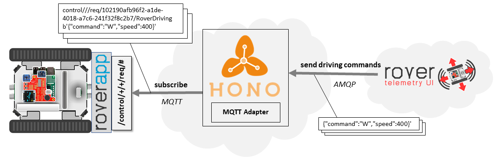
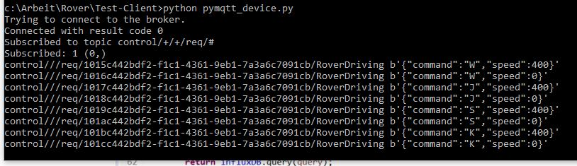

.. toctree::
   :glob:

.. _rovertutorial:

Rover Tutorials
#################

This page features tutorials regarding the development of Rover applications (Marker Detection) as well as the integration with Cloud applications, e. g. for sending driving commands to the Rover.

*******************************
Rover In-vehicle Applications
*******************************

Useful Links
=============
* `Python Script for Simulating a Cloud Application <https://github.com/app4mc-rover/rover-utility/blob/master/Cloud/scripts/pyamqp.py>`_

Marker Detection
=================

Marker detection is gaining great importance in various domains such as robot navigation, augmented reality, etc.
The process behind is based on finding correspondences between points in the real environment and their 2d image projection.

* Pose estimation tutorial: https://docs.opencv.org/3.1.0/d5/dae/tutorial_aruco_detection.html

Requirements
--------------

* OpenCV version 3.4.1 as explained :ref:`here <roverappinstallation>`
* Calibrated Raspbian camera as explained :ref:`here <rovermarkerinstallation>`

Running Marker Detection
------------------------

The Roverapp contains both a marker chaser application and a pose estimation application.
To start them, just do the following:

.. code-block:: bash
    :linenos:

     $ cd ~/temp/rover-app/build
      sudo modprobe bcm2835-v4l2

Then, you can either start

.. code-block:: bash
    :linenos:

      $ ./bin/MarkerChaser

or

.. code-block:: bash
    :linenos:

      $ ./bin/poseEstimation

Potential Use Cases
----------------------

* Marker chaser: Move the rover such that the marker is always in the middle.
* Platooning: Create a platoon by following other Rovers with a marker on it.

*******************************
Rover Cloud Applications
*******************************

Useful Links
=============

* `Eclipse Hono Command & Control API <https://www.eclipse.org/hono/api/command-and-control-api/>`_
* `Eclipse Hono Command & Control API Example <https://github.com/eclipse/hono/blob/master/example/src/main/java/org/eclipse/hono/vertx/example/base/HonoExampleApplicationBase.java>`_
* `Rover Telemetry UI Backend <https://github.com/app4mc-rover/rover-telemetry-ui-cc-be>`_
* `Rover Telemetry UI Frontend <https://github.com/app4mc-rover/rover-telemetry-ui-cc-fe>`_
* `Python Script for Simulating a Device <https://github.com/app4mc-rover/rover-utility/blob/master/Cloud/scripts/pymqtt.py>`_

Command & Control via Rover Telemetry UI
==========================================

In the following sections, we'll use Eclipse Hono to send a Command & Control message from a business application in the Cloud to the Rover.

The example is based on the Rover Telemetry UI Backend, which takes the user input from the Rover Telemetry UI Frontend and then sends Command & Control message to the according Rover.

Connect to Eclipse Hono
-------------------------

At first, our application needs to connect to Hono via AMQP as shown in `HonoConnector.java <https://github.com/app4mc-rover/rover-telemetry-ui-cc-be/blob/master/src/main/java/com/appstacle/telemetryui/util/HonoConnector.java>`_.
To do so, we need to provide the according connection details and credentials.
For the Rover Telemetry UI Backend, this can be done within the `application.properties <https://github.com/app4mc-rover/rover-telemetry-ui-cc-be/blob/master/src/main/resources/application.properties>`_

Sending Command & Control Messages
------------------------------------

The next step would then to actual send the :ref:`driving commands <_rovercommandcontrol>` to the Rover as shown in the ``sendCommand()`` method in `CommandControlService.java <https://github.com/app4mc-rover/rover-telemetry-ui-cc-be/blob/master/src/main/java/com/appstacle/telemetryui/service/CommandControlService.java>`_.
Basically, Hono receives the Command & Control message and take care that message, regardless of the used protocol, are sent to the right device (based on the ``deviceID``).
In this example, messages are sent to the Rover via Hono's MQTT adapter.

Testing your application
-------------------------

For testing that driving commands arrives at the device, the above mentioned python script can be used.
When setting the according credentials, the script connects to the MQTT adapter of Eclipse Hono instance.
As soon as a Cloud application send a Command & Control message to the device, the according driving command is printed in the console:

